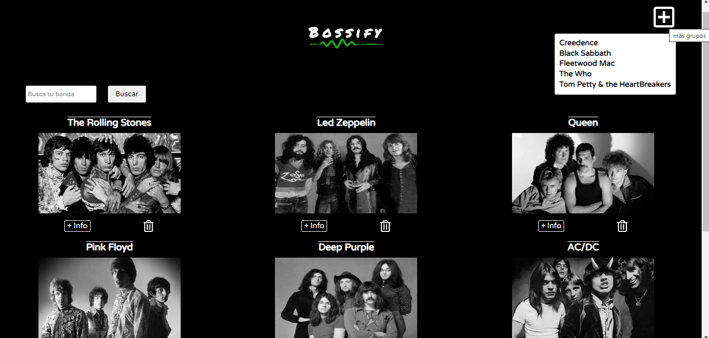

# Aplicación de web. Música de Rock Boosify

## Objetivo

El objetivo es crear una aplicación web a través del framework Angular desarrollado en TypeScript que muestre bandas de rock de los años 70.

Esta aplicación tiene varios requisitos:

- Al abrir la aplicación debe aparecer un listado de bandas de rock. Al pinchar en cualquiera bde ellas debe de llevarte al detalle de cada banda con más información sobre sus miembros y su historia.
- Es importante poder borrar las bandas que no te gusten y no quieras que aparezcan en tu lista.
- Poder agregar otras bandas también del rock de los años 70.

## Instalación del proyecto

Puedes clonarte el repositorio a través de este enlace, poniendo en la consola: **git clone https://github.com/adharamonzon/angular-rocks-adhara-monzon.git**

Después de haberlo clonado necesitas hacer npm install

El repositorio ya está clonado, he instalado y listo para poder usar, con el comando en consola **ng serve** para ejecutar el localhost.
